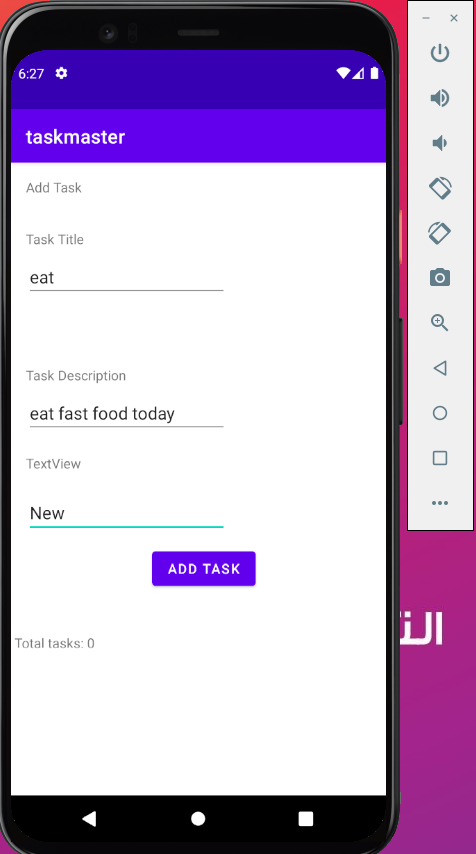

# Taskmaster Android App:

This App will contains tasks to do.. and you can add tasks and display your all tasks
There ara three main activities:

1. `MainActivity`: (The home page which from it you can go to add a new task or to see the all tasks)
2. `AddTaskActivity`: (The page which let you add a new task)
3. `AllTasksActivity`: (The page which displays the all tasks for you).

### _________________________________

***(lab 26):***

* created the three activities and add the appropriate components inside them.
* connect them with the buttons in the MainActivity(Add Task, All Tasks).
* No functionalities yet, except the move on the activities using the previous two buttons

*Screenshots:*

MainActivity:

 
 
 
 

AddTaskActivity:

 
 
 
 

AllTasksActivity:

### ________________________________
***For (lab 27):***

* update the home page (Main Activity) to be contains userName which hold the user name (which is set by user from the settings page) and three tasks buttons, and one button for settings.
* Add TaskDetailActivity that contains title (from the tapped button of the home page), and hard coded description for now.
* Add SettingsActivity, which contain field to enter the userName, and save button to save the user name in the sharedPreferences.. to persist and access this name from the homePage.

*Screenshots:*

MainActivity:

 
 
 
 

TaskDetailsActivity:

 
 
 
 

SettingsActivity:

### _________________________________
*** (lab 28):***

* update the home page (Main Activity) to be contains RecyclerView which hold the list of tasks and view it as a list for the user and when ever you click in one of list item it will open the task detail page.
* create a fragment to hold the style for each task..(title, body, state)
* create taskAdapter for binding the data with the view(fragment styles)
* connect them together and set onClick listener on each ViewHolder to response for user click and go on the task details page with the title of the tapped task

*Screenshots:*

MainActivity:

 
 
 
 

TaskDetailsActivity: (same as the previous one but it appear after clicking in one of the list in the main page )

### _________________________________
***(lab 29):***

* update the home page to be contains main title which hold the user name (which is set by user from the settings page) and RecyclerView which hold the list of tasks and view it as a list for the user, a button for settings, and a button for add a task.
* Edit the TaskDetailsActivity to reflect the all data entered by the user (Title, Body, State), Not just the title.
* create a Room DataBase which is local db that hold the user's data (task).
* create the task entity and task DAO (Data Access Object) to let me manipulate the data in the DB (read, add, update, delete).
* Edit in the mainActivity especially in the declaration of the Adapter .. to take the list of tasks from the DB (getAllTasks())

*Screenshots:*

MainActivity:

 
 
 
 

AddTaskActivity:

 
 
 
 

 
 
 
 

### _________________________________